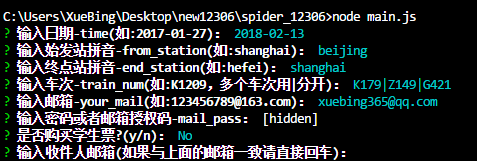
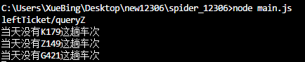
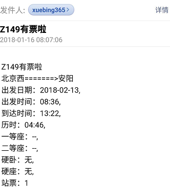

# spider_12306
## 目前已重新支持使用，如有功能需求建议，可在issue里提
## 适用场景：
  * 已经确定火车的车次和时间
## 使用方法：
  * 克隆代码到本地``` git clone https://github.com/haoxuebing/spider_12306 ``` 
  * 在当前文件夹终端``` npm install ```安装依赖
  * ```node main.js```，第一次运行会要求输入信息并且存入config.json，以后再次运行只会读取config.json中的数据，不会要求再次输入。如：<br/>
  
  * 运行结果如下：<br/>
  
  * 发送邮件:<br/>
  
  * ```node main.js -r```可以重写config.json(重新输入信息)。
  * 车次(```train_num```字段)可以输入多个车次，用|分开，如K123|K234(前提这些车次都在同一线路上)。
  * 12306检测到余票查询这个接口有大流量的时候，会更换余票查询的地址，所以才会报错，现在自动爬取这个地址，应该不会报错，输入的问题也解决了，后续研究研究怎么自动下单（不过要实现这个应该不简单= =，我工作也很忙呀）。
